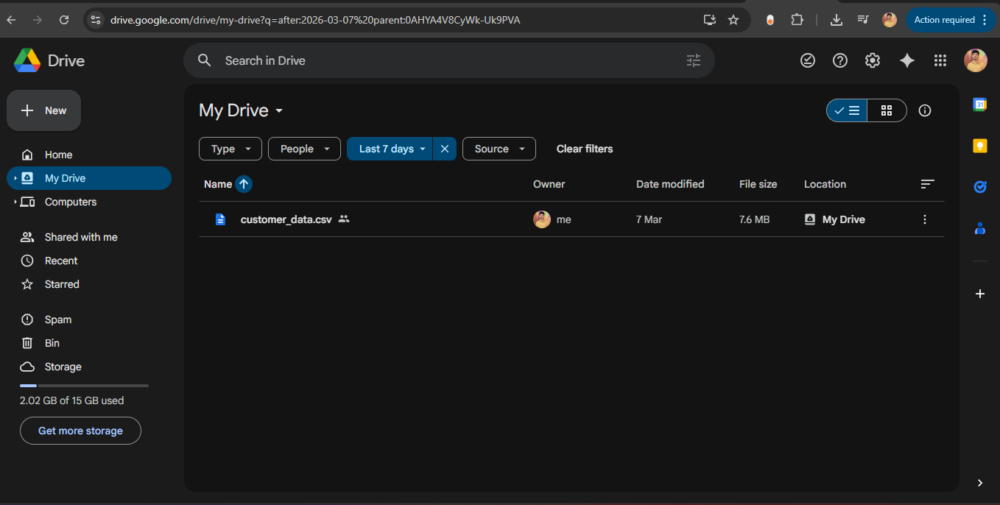
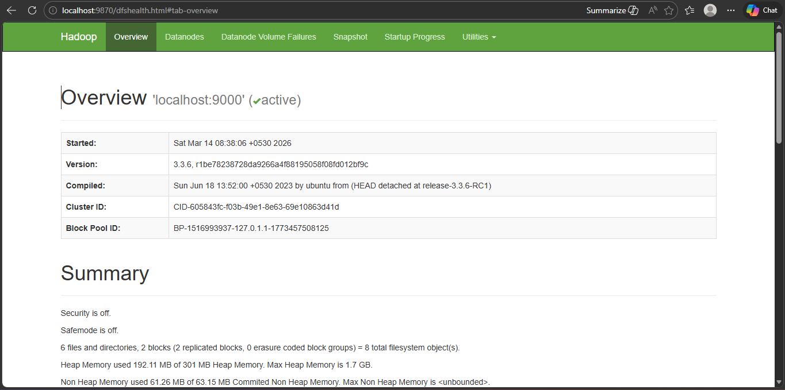
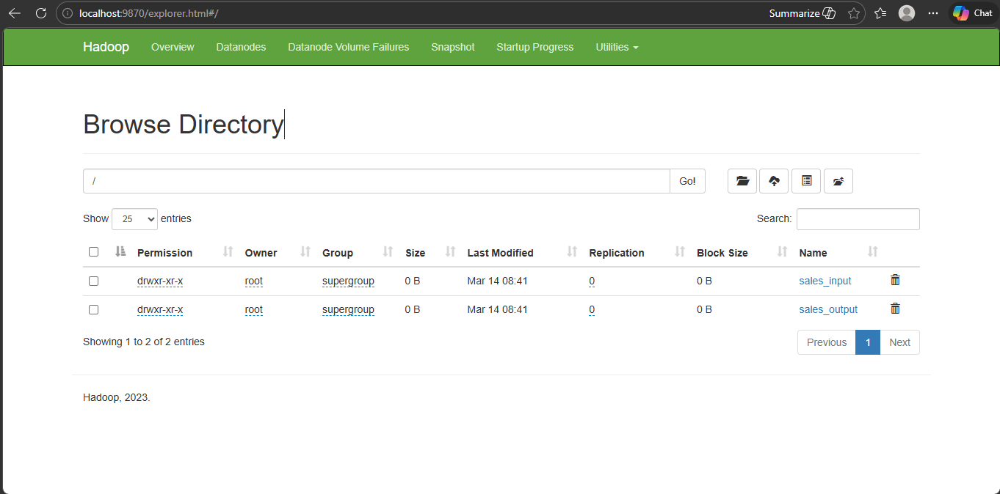

# 🐘 Hadoop MapReduce — Sales Data Analysis

A step-by-step guide to processing a customer sales dataset using **Hadoop 3.3.6 Streaming** with Python-based MapReduce functions. The job computes total purchase amounts grouped by **Region + Product Category**.

---

## 📋 Table of Contents

- [Prerequisites](#prerequisites)
- [Step 1 — Install Hadoop](#step-1--install-hadoop)
- [Step 2 — Configure Hadoop](#step-2--configure-hadoop)
- [Step 3 — Download Dataset & Upload to HDFS](#step-3--download-dataset--upload-to-hdfs)
- [Step 4 — Create Mapper & Reducer](#step-4--create-mapper--reducer)
- [Step 5 — Execute the MapReduce Job](#step-5--execute-the-mapreduce-job)
- [Step 6 — View the Output](#step-6--view-the-output)

---

## Prerequisites

Ensure the following are installed on your system before starting:

| Tool | Version |
|------|---------|
| OS | Ubuntu 22.04 (WSL or native) |
| Java (OpenJDK) | 1.8.0+ |
| Python | 3.10+ |

**Install Python3 if not installed:**

```bash
sudo apt install python3-pip python3-dev
```
**Install java if not installed:**

```bash
sudo apt install openjdk-8-jdk -y
```

**Verify installations:**

```bash
java -version
python3 --version
whereis python3
whereis java
```

---

## Step 1 — Install Hadoop

**1.1 Download Hadoop 3.3.6:**

```bash
wget https://downloads.apache.org/hadoop/common/hadoop-3.3.6/hadoop-3.3.6.tar.gz
```

**1.2 Extract the archive:**

```bash
tar -xvzf hadoop-3.3.6.tar.gz
```

**1.3 Move Hadoop to `/usr/local/hadoop`:**

```bash
sudo mv hadoop-3.3.6 /usr/local/hadoop
```

**1.4 Set environment variables in `~/.bashrc`:**

```bash
vi ~/.bashrc
```

Add the following lines at the bottom of the file:

```bash
export HADOOP_HOME=/usr/local/hadoop
export PATH=$PATH:$HADOOP_HOME/bin:$HADOOP_HOME/sbin
export JAVA_HOME=/usr/lib/jvm/java-8-openjdk-amd64
```

Save and reload:

```bash
source ~/.bashrc
```

**1.5 Verify Hadoop installation:**

```bash
hadoop version
```

Expected output:
```
Hadoop 3.3.6
```

---

## Step 2 — Configure Hadoop

**2.1 Open the configuration files:**

```bash
vi $HADOOP_HOME/etc/hadoop/core-site.xml
vi $HADOOP_HOME/etc/hadoop/hdfs-site.xml
vi $HADOOP_HOME/etc/hadoop/hadoop-env.sh
```

**2.2 Edit `core-site.xml`** — Set the default filesystem:

```xml
<configuration>
  <property>
    <name>fs.defaultFS</name>
    <value>hdfs://localhost:9000</value>
  </property>
</configuration>
```

**2.3 Edit `hdfs-site.xml`** — Set replication factor to 1 (single node):

```xml
<configuration>
  <property>
    <name>dfs.replication</name>
    <value>1</value>
  </property>
</configuration>
```

**2.4 Edit `hadoop-env.sh`** — Add Java path and user settings at the bottom:

```bash
export JAVA_HOME=/usr/lib/jvm/java-8-openjdk-amd64
export HDFS_NAMENODE_USER=root
export HDFS_DATANODE_USER=root
export HDFS_SECONDARYNAMENODE_USER=root
export YARN_RESOURCEMANAGER_USER=root
export YARN_NODEMANAGER_USER=root
```

**2.5 Format the NameNode (first time only):**

```bash
hdfs namenode -format
```

**2.6 Start Hadoop services:**

```bash
start-dfs.sh
start-yarn.sh
```

**2.7 Verify all services are running:**

```bash
jps
```

Expected processes:
```
SecondaryNameNode
ResourceManager
NodeManager
DataNode
NameNode
```

**2.8 Access the Hadoop Web UI:**

Open your browser and navigate to:
```
http://localhost:9870
```

You should see the HDFS Overview page showing `localhost:9000` as **active**.

---

## Step 3 — Download Dataset & Upload to HDFS

**3.1 Upload Dataset CSV file to Google Drive:**



**3.2 Download the dataset (`customer_data.csv`) from Google Drive:**

```bash
wget --no-check-certificate 'https://docs.google.com/uc?export=download&id=<YOUR_FILE_ID>' -O customer_data.csv
```

> The dataset is a 7.6 MB CSV file containing customer purchase records with columns for Region, Product Category, and Purchase Amount.

**3.3 Create a directory in HDFS:**

```bash
hdfs dfs -mkdir /sales_input
```

**3.4 Upload the dataset to HDFS:**

```bash
hdfs dfs -put customer_data.csv /sales_input
```

**3.5 Verify the upload:**

```bash
hdfs dfs -ls /sales_input
```

Expected output:
```
Found 1 items
-rw-r--r--   1 root supergroup   7990263 2026-03-07 08:17 /sales_input/customer_data.csv
```

---

## Step 4 — Create Mapper & Reducer

**4.1 Create and edit the mapper script:**

```bash
vi mapper.py
chmod u+x mapper.py
```

**`mapper.py`** — Reads each CSV row and emits `Region_Product \t PurchaseAmount`:

```python
#!/usr/bin/env python3
import sys
import csv

reader = csv.reader(sys.stdin)
header = next(reader)

for row in reader:
    try:
        region   = row[5]
        product  = row[9]
        purchase = float(row[8])

        key = region + "_" + product
        print(f"{key}\t{purchase}")
    except:
        continue
```

**4.2 Create and edit the reducer script:**

```bash
vi reducer.py
chmod +x reducer.py
```

**`reducer.py`** — Aggregates purchase totals per `Region_Product` key:

```python
#!/usr/bin/env python3
import sys

current_key = None
current_sum = 0

for line in sys.stdin:
    key, value    = line.strip().split("\t")
    value         = float(value)

    if current_key == key:
        current_sum += value
    else:
        if current_key:
            print(f"{current_key}\t{current_sum}")
        current_key = key
        current_sum = value

if current_key:
    print(f"{current_key}\t{current_sum}")
```

---

## Step 5 — Execute the MapReduce Job

Run the Hadoop Streaming job:

```bash
hadoop jar $HADOOP_HOME/share/hadoop/tools/lib/hadoop-streaming*.jar \
  -input /sales_input/customer_data.csv \
  -output /sales_output \
  -mapper mapper.py \
  -reducer reducer.py \
  -file mapper.py \
  -file reducer.py
```

The job will process **100,000 input records** and produce **28 output records** (one per Region + Product combination).

Job summary stats:
```
Map input records=100000
Reduce input groups=28
Reduce output records=28
File Input Format Counters  → Bytes Read=7990263
File Output Format Counters → Bytes Written=664
```

---

## Step 6 — View the Output

**6.1 Read the output from HDFS:**

```bash
hdfs dfs -cat /sales_output/part-00000
```

Expected Output (Region_Product → Total Sales):
```
East_Beauty         14756513.0
East_Books          42636631.0
East_Clothing       57503265.0
East_Electronics    87601533.0
East_Food           42971693.0
East_Health         29200281.0
East_Home           14503949.0

North_Beauty         9372531.0
North_Books         29170898.0
North_Clothing      37793334.0
North_Electronics   58051610.0
North_Food          28782699.0
North_Health        19669329.0
North_Home           9833620.0

South_Beauty        10015411.0
South_Books         28711482.0
South_Clothing      38763855.0
South_Electronics   57430883.0
South_Food          28875354.0
South_Health        19608124.0
South_Home          10274994.0

West_Beauty         14802623.0
West_Books          42655554.0
West_Clothing       58525472.0
West_Electronics    86623277.0
West_Food           42698299.0
West_Health         28814051.0
West_Home           13831819.0
```

**6.2 Browse files via the Hadoop Web UI:**

Navigate to:
```
http://localhost:9870/explorer.html
```


You will see both `sales_input` and `sales_output` directories listed in the HDFS browser.



---